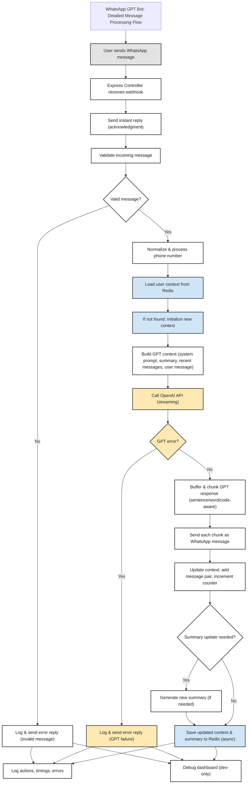

# Financial Advisor Bot

A modern WhatsApp chatbot for financial advisory, powered by OpenAI GPT-4o, with real-time streaming, robust chunking, modular storage (Redis, memory, hybrid), advanced context management, summarization, and a dev-only debug dashboard.

---

## Features

- **WhatsApp Integration** via Twilio
- **AI-Powered Financial Advice** (OpenAI GPT-4o, fallback to GPT-3.5)
- **Real-Time Streaming & Chunking** for WhatsApp message delivery
- **Unified, Sentence-Aware Chunking** (code/list/formatting safe, Hebrew/mixed language aware)
- **Persistent Chat History** with hybrid (memory+Redis) storage
- **Rolling Context Window** and **Dynamic Summarization**
- **Response Caching** for fast repeated answers
- **Parallel Processing Pipeline** for low-latency
- **Comprehensive Logging & Performance Monitoring**
- **Graceful Error Recovery** and fallback flows
- **Extensive Test Coverage** (unit, integration, streaming, chunking)
- **Dev-Only Debug Dashboard**: Visualize message flow, context, GPT input/output, and Redis saves

---

## Message Processing Flow



---

## Debug Dashboard (Development Only)

- **Path:** `/debug-dashboard` (served only in development mode)
- **How to use:**
  1. Start the server with `NODE_ENV=development`
  2. Open [http://localhost:3000/debug-dashboard](http://localhost:3000/debug-dashboard)
  3. Manually reload to see the latest message flow
- **What it shows:**
  - Incoming WhatsApp message
  - Context sent to GPT
  - GPT response
  - What is saved to Redis
  - All steps in the flow, with timestamps
- **Implementation:** In-memory, no new routes, no data persisted

---

## Context & Summarization

- **Context**: System prompt, summary (as system message), rolling window of recent message pairs, and the latest user message (always included)
- **Summary**: Short, updated after a threshold of messages/tokens, used as background for GPT
- **Token management**: Context is trimmed to fit within the model's token limit
- **Streaming**: GPT responses are streamed, with idle timeout reset on each chunk

---

## .env and .gitignore

- **.env**: Store all secrets and environment variables here (see below)
- **.gitignore**: Ensures `.env`, `node_modules/`, logs, coverage, debug dashboard, and other artifacts are not committed

---

## Message Chunking: Unified Algorithm

All outgoing WhatsApp messages use a single robust chunking function:

- **Function:** `splitMessageOnWordBoundary(text, maxLen)` (see `services/messagingService.js`)
- **Rules:**
  - Sentence-aware: prefers splitting at `.`, `!`, `?`
  - Code/list/formatting safe: never splits inside code blocks, lists, or WhatsApp formatting
  - Hebrew/mixed language: splits at spaces/punctuation, avoids breaking words
  - Fallback: force-splits if no safe boundary
  - Handles null/empty/non-string input gracefully
  - Logs all chunking actions/errors
- **All controllers, queue, pipeline, and streaming flows use this function.**

---

## API Endpoints

### POST `/whatsapp/enhanced`
- **Recommended.** Optimized, streaming, chunked, robust.
- **Request:**
  ```json
  { "Body": "User message", "From": "whatsapp:+1234567890", "To": "whatsapp:+1234567890" }
  ```
- **Response:** `{ "status": "processing" }` (immediate)
- **Behavior:**
  - Sends instant WhatsApp ack (customizable, see `config/hebrew.js`)
  - Streams GPT response, chunked, to user
  - Logs all actions, errors, and performance

### POST `/whatsapp/streaming`
- **Streaming endpoint.**
- **Request:** Same as above
- **Behavior:**
  - Streams GPT response, chunked, to user as WhatsApp messages

### GET `/health/enhanced`
- Health check for enhanced controller

### GET `/stats/enhanced`
- Performance and usage stats

---

## Storage Providers

- **Redis**: Fast, persistent, recommended for production
- **In-Memory**: For development/testing
- **Hybrid**: Combines memory (fast) and Redis (persistent, fallback)
- **Configurable via `STORAGE_TYPE` env var**

**Hybrid Example:**
```js
const HybridStorageProvider = require('./services/storage/hybridStorageProvider')
const storage = new HybridStorageProvider(config)
```

---

## Configuration

### Environment Variables

| Variable | Description | Required | Default |
|----------|-------------|----------|---------|
| `NODE_ENV` | Environment | No | `development` |
| `PORT` | App port | No | `3000` |
| `OPENAI_API_KEY` | OpenAI API key | Yes | - |
| `TWILIO_ACCOUNT_SID` | Twilio SID | Yes | - |
| `TWILIO_AUTH_TOKEN` | Twilio Auth | Yes | - |
| `TWILIO_WHATSAPP_NUMBER` | WhatsApp number | Yes | - |
| `REDIS_URL` | Redis URL | Yes (if using Redis/Hybrid) | - |
| `STORAGE_TYPE` | `redis`, `memory`, `hybrid` | No | `redis` |
| `LOG_LEVEL` | Logging level | No | `info` |
| `CHUNK_SEND_DELAY_MS` | Delay between chunk sends (ms) | No | `250` |

**For secure Redis:**
- `REDIS_TLS_CA`, `REDIS_TLS_CERT`, `REDIS_TLS_KEY`, `REDIS_TLS_REJECT_UNAUTHORIZED`

---

## Running & Testing

### Install
```bash
npm install
```

### Development
```bash
npm run dev
```

### Production
```bash
NODE_ENV=production npm start
```

### Testing
```bash
npm test
# or run specific test
npx jest tests/enhancedWhatsappController.test.js
```

---

## Logging & Monitoring

- **Winston logger**: All actions, errors, chunking, and performance are logged
- **PerformanceTracer**: Tracks durations, errors, and success rates for all flows
- **/stats/enhanced**: Exposes stats for monitoring
- **Health checks**: `/health/enhanced` endpoint
- **Recommended:** Export metrics to Prometheus/Grafana for production

---

## Error Handling & Recovery

- **Immediate WhatsApp ack** (even if processing fails)
- **Retries** for chunk send, fallback to error message if all fail
- **Fallback to GPT-3.5** if GPT-4o fails/times out
- **Graceful degradation**: If Redis is down, uses memory fallback
- **All errors logged with context**

---

## Contributing

- Follow modular, testable patterns
- Add/extend storage providers via `services/storage/`
- All new message flows must use unified chunking
- Add/extend tests for new features and edge cases

---

## License

MIT License - see LICENSE file for details. 